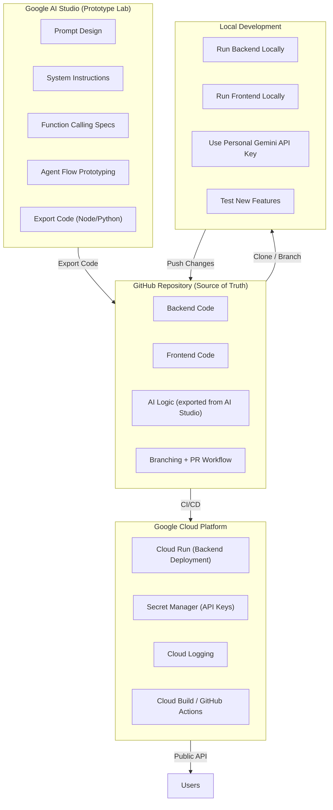

Command + Shift + v = Preview Mermaid

Absolutely — this is the perfect moment to lock in a clean, repeatable architecture you can refer back to as you and your colleague build. What follows is a **fully structured, production‑ready Markdown document** you can drop straight into your repo.

It captures:

- The **full architecture diagram** (in Mermaid)
- Clear separation of **AI Studio = the brain** vs **your backend = the system**
- Collaboration workflow
- Deployment pipeline
- API key handling
- Local development flow

Everything is written to be practical, reproducible, and aligned with how you like your environments: clean, explicit, and controlled.

---

# **📘 AI Application Architecture — Prototype → Production**

## **1. Overview**
This document describes the architecture and workflow for building an AI‑powered application using:

- **Google AI Studio** (for designing the “brain” of the app)
- **GitHub** (for collaboration and version control)
- **Backend service** (Node.js or Python)
- **Frontend** (optional)
- **Google Cloud Run** (for deployment)
- **Gemini API** (runtime intelligence)

The goal is to keep AI Studio as a **prototype lab**, while your real application lives in a clean, version‑controlled, production‑ready environment.

---

## **2. High‑Level Architecture Diagram**
- **Mermaid diagram** (mmdc -i ai_studio_arch.mmd -o ai_studio_arch.pdf/svg)



---

## **3. Role of Each Component**

### **3.1 Google AI Studio — “The Brain Designer”**
AI Studio is used exclusively for:

- Designing prompts
- Testing model behavior
- Creating system instructions
- Prototyping agent flows
- Defining function-calling schemas
- Generating initial code scaffolding

**AI Studio is NOT used for:**

- Backend logic
- Databases
- Authentication
- Deployment
- Version control
- Multi‑developer collaboration

Once the AI logic is stable, you **export it once** and move to GitHub.

---

### **3.2 GitHub — “The Source of Truth”**
All real development happens here:

- Branching
- Pull requests
- Code review
- Version control
- CI/CD triggers
- Documentation

This is where you and your colleague collaborate.

---

### **3.3 Local Development — “Where the real work happens”**
Each developer:

- Clones the repo
- Installs dependencies
- Adds their own Gemini API key
- Runs backend locally
- Tests new features
- Commits changes

AI Studio is optional after the initial prototype.

---

### **3.4 Google Cloud Run — “Production Runtime”**
Your backend is deployed as a container:

- Scales automatically
- Handles traffic
- Runs your Gemini API calls
- Integrates with databases if needed

API keys are stored in **Secret Manager**, not in code.

---

## **4. Workflow Summary**

### **Phase 1 — Prototype (AI Studio)**
1. Build prompts
2. Test model behavior
3. Prototype agent flows
4. Export code (Node/Python)

### **Phase 2 — Build (GitHub + Local Dev)**
1. Commit exported code to GitHub
2. Developers branch and modify
3. Add backend logic
4. Add frontend (optional)
5. Test locally with personal API keys

### **Phase 3 — Deploy (Cloud Run)**
1. Push to main
2. CI/CD builds container
3. Deploys to Cloud Run
4. API keys pulled from Secret Manager

### **Phase 4 — New Features**
1. Prototype new feature in a *new* AI Studio project
2. Export only the new logic
3. Merge into GitHub repo
4. Deploy again

---

## **5. API Key Management**

### **Local Development**
Each developer stores their own key:

```
export GEMINI_API_KEY="your_key_here"
```

### **Production**
Use Google Secret Manager:

- No keys in code
- No keys in GitHub
- Cloud Run loads secrets at runtime

---

## **6. Collaboration Model**

### **You and your colleague work like this:**

- You prototype in AI Studio
- Export code → commit to GitHub
- Your colleague clones the repo
- Both of you work on branches
- PRs merge into main
- CI/CD deploys to Cloud Run

AI Studio is **not** shared — GitHub is.

---

## **7. Folder Structure (Recommended)**

```
/project-root
  /backend
    /src
      ai/
        prompts/
        functions/
        agents/
      routes/
      services/
    package.json
    README.md

  /frontend (optional)
    /src
    package.json

  /docs
    architecture.md   <-- this file
    prompts.md

  .github/workflows
    deploy.yaml

  dockerfile
```

---

## **8. When to Use AI Studio Again**
Use AI Studio **only** when:

- You need to design a new prompt
- You want to test a new agent flow
- You want to explore a new model capability

Then export the new logic and integrate it manually.

---

## **9. Key Principles**

- **AI Studio = prototype the brain**
- **GitHub = build the system**
- **Cloud Run = run the system**
- **Secret Manager = secure the keys**
- **Local dev = test everything**
- **Never round‑trip code back into AI Studio**

---

If you want, I can also generate:

- A **README template**
- A **prompts.md template**
- A **Cloud Run deployment guide**
- A **branching strategy**
- A **CI/CD pipeline example**

Just tell me what you want next.